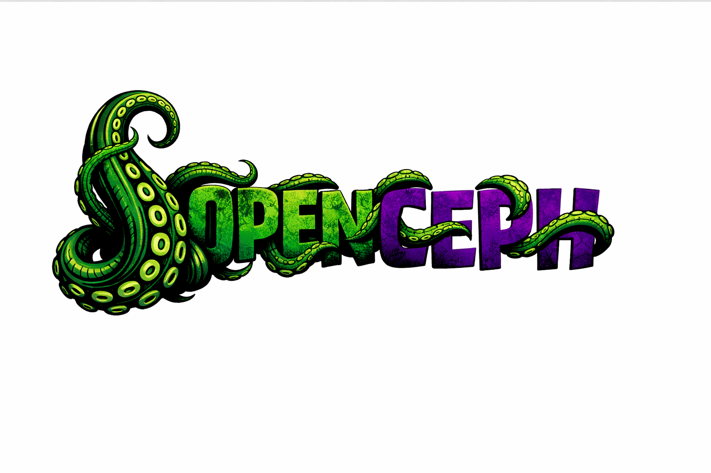

# 🐙 OpenCeph — Proactive AI Personal Operating System

<p align="center">
    
</p>

<p align="center">
  <strong>Your first true personal staff. Not a better information tool — a brain that works for you.</strong>
</p>

<p align="center">
  <a href="LICENSE"></a>
  <a href="#"></a>
  <a href="#"></a>
  <a href="#"></a>
</p>

**OpenCeph** is a _proactive AI personal operating system_ that runs on your own devices. Unlike traditional AI assistants that wait for you to ask, OpenCeph **works autonomously** — monitoring, analyzing, and reporting through its tentacle system. It connects to the channels you already use (Telegram, Feishu, WebChat, CLI), remembers everything, and only bothers you when something actually matters.

Think of it this way: you hired a batch of employees who know their responsibilities, are doing their jobs, and only report important matters back to you.

## Highlights

- **Proactive, not reactive** — Tentacles run 24/7 monitoring, analyzing, and filtering. You get push notifications, not pull workflows.
- **Multi-channel Gateway** — Telegram, Feishu, WebChat, CLI. One brain, every surface you already use.
- **Autonomous Tentacles** — Independent agent subprocesses with a three-layer architecture: daemon (data fetching), agent (LLM analysis), consultation (Brain review).
- **Long-term Memory** — Persistent knowledge base with MEMORY.md, daily logs, and SQLite FTS5 semantic search.
- **Heartbeat & Cron** — Scheduled tasks and proactive push with intelligent deduplication, priority sorting, and timezone-aware delivery.
- **Skill System** — Drop in Python/TypeScript/Go/Shell skills that auto-spawn as tentacles. 7 builtin tentacles included.
- **Pi Framework Core** — Built on @mariozechner/pi-agent-core with tool streaming, context compression, and model failover.
- **MCP Bridge** — Connect any MCP server to extend the Brain's tool capabilities.
- **Workspace Files** — 8 editable markdown files (SOUL, AGENTS, IDENTITY, USER, TOOLS, HEARTBEAT, TENTACLES, MEMORY) define your agent's personality, rules, and knowledge.

## Install (recommended)

Runtime: **Node ≥22**.

```bash
npm install
npm run build

# Initialize the ~/.openceph/ directory structure
npm start -- init
```

## Quick start (TL;DR)

Runtime: **Node ≥22**.

```bash
# 1. Initialize (first time only)
openceph init

# 2. Set your API credentials
openceph credentials set openrouter <YOUR_KEY>

# 3. Start the full system (Gateway + Brain + all channels)
openceph start

# Or: CLI-only chat mode (no Gateway, no channels)
openceph chat
```

Development mode (auto-reload):

```bash
npm run dev -- start
```

## How it works (short)

```
Telegram / Feishu / WebChat / CLI
               │
               ▼
┌───────────────────────────────┐
│            Gateway            │
│     (message routing layer)   │
│     ws://127.0.0.1:18790      │
└──────────────┬────────────────┘
               │
               ├─ Brain Agent (Pi Framework)
               │    ├─ System Prompt (SOUL.md + AGENTS.md + context)
               │    ├─ Tool Execution (16+ tool types)
               │    ├─ Memory System (MEMORY.md + FTS5 search)
               │    └─ Model Failover (Anthropic / OpenAI / OpenRouter)
               │
               ├─ Tentacle Manager
               │    ├─ Tentacle 1 (hn-radar)
               │    ├─ Tentacle 2 (arxiv-paper-scout)
               │    ├─ Tentacle 3 (github-release-watcher)
               │    └─ Tentacle N ... (user-created)
               │
               ├─ Heartbeat Scheduler (proactive push)
               ├─ Cron Scheduler (timed tasks)
               └─ Push Decision Engine (dedup + priority + delivery)
```

## Key subsystems

- **[Brain](#brain)** — central intelligence, handles all user interaction, tool execution, and tentacle coordination.
- **[Gateway](#gateway)** — multi-channel message routing layer with session pairing and DM access control.
- **[Tentacles](#tentacle-system)** — autonomous agent subprocesses with three-layer architecture.
- **[Memory](#memory)** — long-term knowledge persistence with FTS5 semantic search.
- **[Heartbeat](#heartbeat--cron)** — proactive push mechanism with timezone-aware delivery.
- **[Cron](#heartbeat--cron)** — scheduled task management with daily review and maintenance jobs.
- **[Push Engine](#push-decision-engine)** — intelligent dedup, priority sorting, and feedback tracking.
- **[Skills](#skill-system)** — dynamic capability extension via SKILL.md blueprints.

### Brain

The central intelligence built on Pi Framework. Handles all user interaction, tool execution, and tentacle coordination. Dynamic system prompt assembled from 8 workspace files. Supports Anthropic Claude, OpenAI, and 2000+ models via OpenRouter. Includes prompt caching, context compression (4-layer defense), loop detection, and automatic model failover.

**Message flow**: Channel → Gateway Router → `Brain.handleMessage()` → Tool execution → Response → Channel → User

### Gateway

Multi-channel message routing layer. Adapters for Telegram (grammY), Feishu (Lark SDK), WebChat (Express + ws), and CLI (readline). Handles session pairing, DM access control (pairing/allowlist/open/disabled), typing indicators, and streaming. Plugin architecture for extension channels.

### Tentacle system

Autonomous agent subprocesses — the octopus's arms. Each tentacle is an independent process communicating with the Brain via stdin/stdout JSON-Lines IPC.

**Three-layer architecture**:
- **Layer 1 — Daemon**: Pure code, no LLM. Continuous data fetching, rule-based filtering, accumulation.
- **Layer 2 — Agent**: LLM-powered analysis on accumulated items when batch threshold is reached.
- **Layer 3 — Consultation**: Multi-turn dialogue with Brain for uncertain findings (confidence 0.4–0.8).

**IPC Protocol**: `tentacle_register` → `report_finding` / `consultation_request` → `directive` (pause/resume/kill)

**Health scoring**: Automatic weakening/strengthening based on report quality. Low-health tentacles get killed.

**7 builtin tentacles**:

| Tentacle | Description |
|----------|------------|
| `hn-radar` | Hacker News monitoring with LLM filtering |
| `arxiv-paper-scout` | ArXiv paper tracking by research interests |
| `github-release-watcher` | GitHub release monitoring for key repos |
| `daily-digest-curator` | Daily summary generation and delivery |
| `price-alert-monitor` | Price change detection and alerting |
| `uptime-watchdog` | Service availability monitoring |
| `skill-tentacle-creator` | Scaffolding tool for creating new tentacles |

### Memory

Long-term knowledge persistence. `MEMORY.md` is the central knowledge base (user-editable). Daily logs at `~/.openceph/workspace/memory/YYYY-MM-DD.md`. SQLite FTS5 full-text search for semantic retrieval. Memory distillation triggered by Heartbeat.

### Heartbeat & Cron

**Heartbeat**: Proactive push mechanism. Configurable frequency (e.g., every 24h). Brain evaluates "what to push" in an isolated heartbeat session. Supports `immediate`, `best_time` (deferred to morning window), and `morning_digest` (batched daily summary) delivery modes.

**Cron**: Scheduled task management. Supports cron expressions, fixed intervals, and specific times. Jobs run in main session mode (queue events) or isolated session (runs AI turn). Includes maintenance jobs: `daily-review` (reflection) and `morning-digest-fallback` (deferred push delivery).

### Push Decision Engine

Intelligent message delivery. Deduplication (URL-based + similarity checking). Priority levels: urgent, high, normal, low. Daily push limits. Feedback tracking monitors user reactions to adjust future push quality.

### Skill System

Dynamic capability extension. Scans `~/.openceph/skills/` for skill blueprints. Transforms SKILL.md definitions into standalone tentacles. Supports Python, TypeScript, Go, and Shell runtimes. Claude Code integration for code generation and deployment.

## Everything we built so far

### Core platform

- Gateway with multi-channel message routing, session management, and WebSocket control plane.
- Pi agent runtime with tool streaming, context compression, and block streaming.
- Session model with per-user isolation, auto-reset on daily schedule or idle timeout.
- Brain with 16+ tool types: memory, user, session, web, tentacle, code, cron, heartbeat, skill, MCP.
- Structured event logging with Winston daily-rotate across all subsystems.

### Channels

- **Telegram** — grammY bot framework with streaming support, typing indicators, and reaction acks.
- **Feishu** — Lark Suite SDK integration with event subscription and message cards.
- **WebChat** — Express HTTP + WebSocket server for browser-based interaction.
- **CLI** — readline-based terminal interface for local development and testing.

### Tools & automation

- Memory tools: read, write, search, update, delete long-term memory.
- Web tools: search and fetch via MCP bridge.
- Tentacle tools: spawn, pause, resume, kill, list tentacles.
- Skill tools: list, inspect, spawn skills as tentacles.
- Cron tools: create, list, edit, remove scheduled jobs.
- Code agent: Claude Code integration for code generation, validation, and deployment.
- Session tools: manage conversation sessions across channels.
- Heartbeat tools: control proactive push behavior.

### Runtime & safety

- DM pairing access control (pairing/allowlist/open/disabled policies).
- Credential store with file-based, environment variable, and macOS Keychain support.
- Model failover with auth profile rotation across providers.
- Context compression (4-layer defense): context window guard, tool result guard, context pruning, compaction.
- Loop detection with configurable thresholds (warning at 10, critical at 20 steps).

## Chat commands

Send these in Telegram / Feishu / WebChat:

| Command | Description |
|---------|------------|
| `/new` | Reset the current session |
| `/model <name>` | Switch the active model |
| `/think <level>` | Set reasoning level |
| `/help` | Show available commands |
| `/status` | Show session status |
| `/tentacles` | List active tentacles |
| `/skill` | List / spawn skills |
| `/pause` | Pause current tentacle |
| `/resume` | Resume paused tentacle |
| `/cost` | Show usage cost summary |

## Configuration

Minimal `~/.openceph/openceph.json`:

```json5
{
  brain: {
    model: "anthropic/claude-sonnet-4-20250514",
  },
}
```

Full configuration uses JSON5 with Zod schema validation. 100+ configurable options covering model selection, channel settings, tentacle defaults, cron schedules, heartbeat frequency, push limits, and more.

### Credentials

```bash
# Set API key
openceph credentials set openrouter <KEY>
openceph credentials set anthropic <KEY>

# Or use environment variables
export OPENROUTER_API_KEY=sk-...

# Or macOS Keychain
# credentials: "keychain:openceph-openrouter"
```

Credentials are stored in `~/.openceph/credentials/` with mode 600.

### Channels

#### Telegram

```json5
{
  channels: {
    telegram: {
      botToken: "123456:ABCDEF",
      // allowFrom: ["user_id_1", "user_id_2"],
      // dmPolicy: "pairing",
    },
  },
}
```

#### Feishu

```json5
{
  channels: {
    feishu: {
      appId: "cli_xxx",
      appSecret: "xxx",
      // encryptKey: "xxx",
      // verificationToken: "xxx",
    },
  },
}
```

#### WebChat

```json5
{
  channels: {
    webchat: {
      enabled: true,
      // port: 18790,
    },
  },
}
```

#### CLI

Enabled by default in development. Start with:

```bash
openceph chat
```

## Security defaults (DM access)

OpenCeph connects to real messaging surfaces. Treat inbound DMs as **untrusted input**.

- **DM pairing** (`dmPolicy="pairing"`): unknown senders receive a short pairing code and the bot does not process their message.
- Approve with: `openceph pairing approve <channel> <code>` (then the sender is added to a local allowlist store).
- Public inbound DMs require an explicit opt-in: set `dmPolicy="open"`.
- **Credential isolation**: API keys in `~/.openceph/credentials/` with file permissions 600.
- **Auth profiles**: per-provider credential rotation with automatic failover.
- **Tentacle sandboxing**: tentacles communicate only via IPC, cannot contact users directly, file writes scoped to their workspace.

## Agent workspace + skills

Workspace root: `~/.openceph/workspace/`.

| File | Purpose |
|------|---------|
| `SOUL.md` | Personality, values, behavior boundaries |
| `AGENTS.md` | Operational procedures (memory rules, tentacle management, push rules) |
| `IDENTITY.md` | Public identity metadata (name, ID, emoji, version) |
| `USER.md` | User profile (name, projects, interests, communication preferences) |
| `TOOLS.md` | Natural language tool documentation |
| `HEARTBEAT.md` | Daily task checklist for proactive push |
| `TENTACLES.md` | Tentacle registry with status tracking |
| `MEMORY.md` | Refined long-term memory |

All files are user-editable markdown. The Brain's system prompt is dynamically assembled from these files at runtime. Skills live at `~/.openceph/skills/<skill>/SKILL.md`.

## Tentacle development

Tentacles follow a standard directory structure:

```
my-tentacle/
├── SKILL.md               # Blueprint metadata (YAML frontmatter)
├── prompt/
│   └── SYSTEM.md          # Agent system prompt
├── src/
│   ├── main.py            # Entry point (Python/TS/Go/Shell)
│   └── requirements.txt   # Dependencies
├── tools/
│   └── tools.json         # Custom tool definitions (OpenAI format)
├── workspace/             # Runtime state
│   ├── STATUS.md
│   └── REPORTS.md
├── data/                  # SQLite state database
├── reports/               # pending/ and submitted/
└── logs/                  # daemon/agent/consultation
```

**LLM Gateway**: Tentacles access LLM capabilities through an OpenAI-compatible gateway at `http://127.0.0.1:18792`. Token authentication via `OPENCEPH_LLM_GATEWAY_TOKEN`.

**Safety rules**: No hardcoded API keys. No direct external LLM calls. No `os.system()` / `subprocess.Popen()` / `exec()` / `eval()`. No direct user messaging (must go through Brain). File writes limited to tentacle workspace.

## From source (development)

Prefer `npm` or `pnpm` for builds from source.

```bash
git clone <repo-url>
cd openceph

npm install
npm run build

# Initialize
npm start -- init

# Upgrade builtin tentacles
npm start -- upgrade

# Dev loop (auto-reload on source changes)
npm run dev -- start

# Run tests
npm test
```

Note: `npm run dev` runs TypeScript directly (via `tsx`). `npm run build` produces `dist/` for running via Node.

## CLI reference

| Command | Description |
|---------|------------|
| `openceph init` | Initialize `~/.openceph/` directory structure |
| `openceph start` | Start full system (Gateway + Brain + channels) |
| `openceph chat` | CLI-only chat mode (no Gateway) |
| `openceph upgrade` | Sync builtin tentacles to `~/.openceph/skills/` |
| `openceph credentials set <provider> <key>` | Store API credentials |
| `openceph credentials list` | List configured credentials |
| `openceph cron list\|add\|edit\|remove` | Manage scheduled tasks |
| `openceph logs [type]` | View system logs |
| `openceph status` | Show system status |
| `openceph cost` | Show usage cost summary |
| `openceph doctor` | Run system diagnostics |

## Runtime directory structure

```
~/.openceph/
├── openceph.json           # Main configuration (JSON5)
├── credentials/            # API keys and tokens (mode 700)
├── workspace/              # User-editable knowledge base
│   ├── SOUL.md
│   ├── AGENTS.md
│   ├── IDENTITY.md
│   ├── USER.md
│   ├── TOOLS.md
│   ├── HEARTBEAT.md
│   ├── TENTACLES.md
│   ├── MEMORY.md
│   └── memory/             # Daily memory logs (YYYY-MM-DD.md)
├── brain/                  # Pi Framework agent state
├── agents/                 # Agent instances
│   ├── ceph/              # Main Brain (sessions, logs)
│   ├── code-agent/        # Code generation agent
│   └── gateway/           # Gateway event logs
├── tentacles/              # Spawned tentacle instances
│   └── <tentacle-id>/    # Per-tentacle state + logs
├── skills/                 # Skill/tentacle templates
│   ├── hn-radar/
│   ├── arxiv-paper-scout/
│   └── ...
├── cron/                   # Scheduled job definitions + run history
├── logs/                   # System-level logs (cost, cache-trace)
├── state/                  # Runtime state (pairing, queues, PID files)
└── contracts/              # IPC contract schemas
```

## Tech stack

| Category | Technology |
|----------|-----------|
| Runtime | Node.js 22+ |
| Language | TypeScript 5.9 |
| AI Framework | Pi Framework (pi-agent-core 0.60) |
| LLM Providers | Anthropic, OpenAI, OpenRouter (2000+ models) |
| HTTP Server | Express 5 |
| WebSocket | ws 8.x |
| Telegram | grammY |
| Feishu | @larksuiteoapi/node-sdk |
| Scheduling | node-cron |
| Config | JSON5 + Zod 4 validation |
| Logging | Winston + daily-rotate-file |
| Memory Search | SQLite FTS5 |
| CLI | Commander.js |
| Testing | Vitest |

## Who is OpenCeph for?

OpenCeph is built for people who have **things to continuously monitor** or **background tasks they should be doing** — tasks that require judgment (not scriptable), but are too repetitive or time-consuming to do manually.

- **AI Researchers** — auto-running experiment tracking, adaptive strategy adjustment
- **Indie Hackers** — competitor monitoring, user signal discovery, new model API testing
- **AI Founders** — competitive radar, investor activity tracking, community sentiment
- **Open Source Maintainers** — issue prioritization, dependency security, PR progress tracking
- **Quantitative Traders** — 24h market anomaly detection, automated alert strategies
- **Data Scientists** — data quality monitoring, model drift detection, retraining triggers
- **AI Product Managers** — real user feedback aggregation, competitor feature changes

## Community

Contributions welcome! See [CONTRIBUTING.md](CONTRIBUTING.md) for guidelines.

## License

[MIT](LICENSE)
